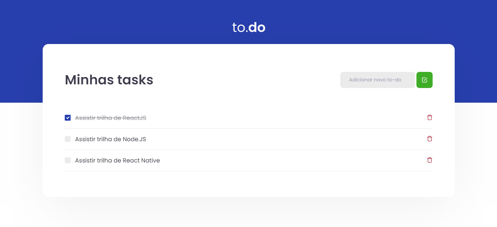

<h1 align="center"> First challenge in ReactJS by Ignite </h1>

 Primeiro desafio em ReactJS pelo Ignite 

  

## 💻 Desafio:

O desafio realizado é uma aplicação onde o seu principal objetivo é o desenvolvimento de algumas funcionalidades para uma pequena aplicação de atividades à fazer, para treinar um pouco mais sobre manipulação do estado no ReactJS, o desafio possui as seguintes funcionalidades abaixo: 

- Adicionar uma nova tarefa
- Remover uma tarefa
- Marcar e desmarcar uma tarefa como concluída

## Tecnologias:

Esse projeto foi desenvolvido com as seguintes tecnologias:

- ReactJS + TypeScript

---

Feito com ajuda pela Rocketseat.
